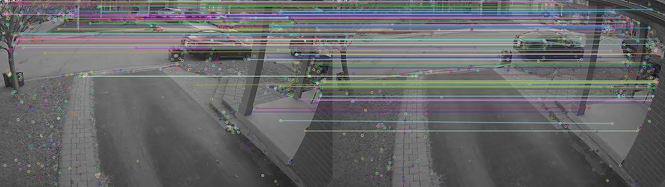
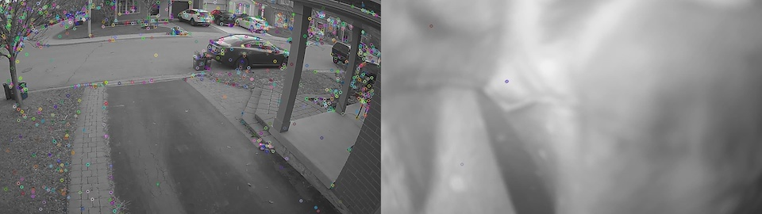
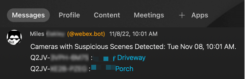
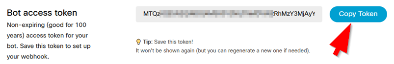

# Meraki MV Image Comparator

If a camera used for safety and security stops working, the Meraki Dashboard will send an alert to configured
recipients. What if a bad actor obfuscates a camera in such a way that it is continuing to function, perhaps
by spray-painting over the dome, or placing a large object in front of it? These scenarios are typically rare
(partly due to defensive installation practices) and even if vandalized, actions would be captured by other 
cameras in the vicinity. However, this question gets raised occasionally and it seemed like an interesting
problem to tackle.

This proof-of-concept application uses OpenCV and Meraki Dashboard APIs to compare camera snapshots with 
previously-captured reference snapshots of what the scene should generally look like. Obviously images will 
never be a match due to noise, lighting, and other expected variations. The premise is that we can use CV
to detect if there is _enough_ similarity between the current and reference image to still be valid.



If the scene is not similar enough a notification is sent. The notification includes the name and a 
direct link to the camera.





## Call For Contributors
This is my first attempt working with OpenCV. I am having difficulty with SIFT keypoint detection and 
matching in some scenes. I suspect someone with expertise in this area could help me significantly improve
this functionality. Your pull requests are welcome, or feel free to get in touch directly.

## Webex Setup
Cisco Webex (formerly known as Webex Teams) is used for collaboration in many organizations. If
you're already a Webex user it just makes sense to bring these notifications into the app.
Even if you're not a Webex user, this application will work with a free account. This could be easily adapted 
to other messaging platforms such as Slack, Microsoft Teams, and email. 

1. If not already using Webex, sign up for an account at https://web.webex.com. Enter your email
address and if you don't have an account and your domain name is an enterprise customer already, you
will receive an email to activate your account. Activate it, set a password, set your display name. 
Click on Try Messaging to begin. 

2. Create a bot account at https://developer.webex.com. You'll have to sign in using your user account
(that you set up in step 1 if not already on the platform.) Click on the link for Bots or otherwise
create a new bot at https://developer.webex.com/my-apps/new/bot. It will require a globally unique
username. Upload a cool icon, or use one of the defaults.  Take note of the username 
(your_bot_name@webex.bot) as well as the Bot API access token.



3. Create a space that you will use for your notifications. You'll probably want to install the mobile 
and/or desktop client(s) on your devices. Once in the app with a space created, invite your bot from 
step 2 to the space using the three-dot menu in the space.

## Installation
This application requires python3 and a scheduling mechanism such as cron. Recommend a Linux virtual machine
for this purpose. Persistent storage is required for the reference images as well as current images being
downloaded for comparison. Depending on size of deployment (number of cameras) this could be significant.
With result image caching (recommended) estimate approx 750 kB per camera.

* Download the code as a zip and extract to an appropriate location or use git to clone this repo
* Copy config/config-sample.ini to config/config.ini and edit values according to your installation
  * the debugging flag can be set to True to output extremely verbose logs (not recommended for long term use)
  * The CV parameters can be left at default values, but see note above about SIFT matching accuracy.
* In the Meraki section, an API key with Org Read and RW for the camera networks is needed. The only write 
operation performed by this utility is to remove the reference_image device tag once a new reference image 
has been collected.
  * PSA: Best practice is to create a Dashboard administration account for this purpose (service account)

## Running the code

1. Update python, install virtualenv
   ```commandline
   python3 -m pip install --user --upgrade pip
   python3 -m pip install --user virtualenv
   ```
   
2. Create a new virtualenv. Not required if installing on a dedicated VM. 
   ```
   virtualenv -p python3 venv
   ```
3. Activate virtualenv:
    ```
   . venv/bin/activate
    ```
4. Install requirements:
   ```
   pip install -r requirements.txt
   ``` ```
5. Run application:
   ```
   python mvImageComparator.py
   ```
6. Setup crontab to run on a scheduled basis. Refer to linux system administration documentation for this. Depending
on size of deployment it may be desired to have two separate instances of this app and config and to alternate days
for each one.